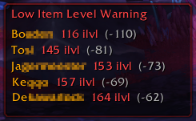
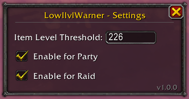

# LowIlvlWarner

A World of Warcraft addon for Midnight (12.x.x) that warns you when players in your party or raid are below a specified item level threshold.

## Screenshots

## Features

- Displays a frame listing every group member below your configured threshold
- Separate enable/disable toggles for parties and raids
- Configurable item level threshold

## Usage

| Action | How |
|---|---|
| Open settings | Left-click the minimap button or `/liw config` |
| Toggle minimap button | `/liw minimap` |
